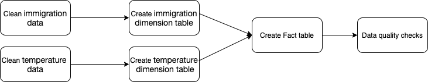

# Project Title
### Data Engineering Capstone Project

#### Project Summary
the project goal is to use the Immigration data and temperature data to enable the analyst to query the compained data in order to be able to determine if the temperature affect the behavior of the Immigration.

The project follows the follow steps:
* Step 1: Scope the Project and Gather Data
* Step 2: Explore and Assess the Data
* Step 3: Define the Data Model
* Step 4: Run ETL to Model the Data
* Step 5: Complete Project Write Up

### Step 1: Scope the Project and Gather Data

#### Scope 
i will use spark to process the Immigration data and the temperature data in order to aggregate the two datasets by the city to get two dimensions table, then i will aggregate the two dimensions table to create the fact table.

#### Describe and Gather Data 
##### I94 Immigration Data: 
* This data comes from the US National Tourism and Trade Office. You can read more about it here https://travel.trade.gov/research/reports/i94/historical/2016.html
* It is in SAS7BDAT format.

##### Notes:

* i94YR = 4 digit year.
* i94MON = numeric month.
* i94CIT = 3 digit code of origin city.
* i94PORT = 3 character code of destination USA city.
* ARRDATE = arrival date in the USA.
* i94MODE = 1 digit travel code.
* DEPDATE = departure date from the USA.
* i94VISA = immigration reason.

##### World Temperature Data: 
* This dataset came from Kaggle. You can read more about it here https://www.kaggle.com/berkeleyearth/climate-change-earth-surface-temperature-data.
* It is in csv format.

##### Notes:
* AverageTemperature = average temperature.
* City = city name.
* Country = country name,.
* Latitude= latitude.
* Longitude = longitude.

### Step 2: Explore and Assess the Data
#### Explore the Data 
* invalid i94PORT
* NaN AverageTemperature
* duplicated locations

#### Cleaning Steps
##### immigration data: 
* remove the rows that contains invalid i94PORT as mentioned in I94_SAS_Labels_Description file.

##### Temperature Data:
* remove the rows that contains NaN AverageTemperature or duplicated locations. 
* adding the I94PORT of the location in each row.

### Step 3: Define the Data Model
#### 3.1 Conceptual Data Model
##### Dimension Table - immigration data Columns:
* I94YR = 4 digit year.
* I94MON = numeric month.
* I94CIT = 3 digit code of origin city.
* I94PORT = 3 character code of destination USA city.
* ARRDATE = arrival date in the USA.
* I94MODE = 1 digit travel code.
* DEPDATE = departure date from the USA.
* I94VISA = immigration reason.
##### Dimension Table - temperature data Columns:
* AverageTemperature = average temperature.
* City = city name.
* Country = country name,.
* Latitude= latitude.
* Longitude = longitude.
* I94PORT = 3 character code of destination USA city.

##### Fact Table - immigration data joined with the temperature Columns:
* year = 4 digit year.
* month = numeric month.
* city = 3 digit code of origin city.
* I94PORT = 3 character code of destination USA city.
* arrival_date = arrival date in the USA.
* travel_code = 1 digit travel code.
* departure_date = departure date from the USA.
* reason = immigration reason.
* AverageTemperature = average temperature of destination city,
* Latitude= latitude.
* Longitude = longitude.

#### 3.2 Mapping Out Data Pipelines
 

### Step 4: Run Pipelines to Model the Data 
#### 4.1 Create the data model
Build the data pipelines to create the data model.

#### 4.2 Data Quality Checks
Explain the data quality checks you'll perform to ensure the pipeline ran as expected. These could include:
 * Integrity constraints on the relational database (e.g., unique key, data type, etc.)
 * Unit tests for the scripts to ensure they are doing the right thing
 * Source/Count checks to ensure completeness
 
Run Quality Checks

#### 4.3 Data dictionary 
Create a data dictionary for your data model. For each field, provide a brief description of what the data is and where it came from. You can include the data dictionary in the notebook or in a separate file.
##### Dimension Table - immigration data Columns:
* I94YR = 4 digit year.
* I94MON = numeric month.
* I94CIT = 3 digit code of origin city.
* I94PORT = 3 character code of destination USA city.
* ARRDATE = arrival date in the USA.
* I94MODE = 1 digit travel code.
* DEPDATE = departure date from the USA.
* I94VISA = immigration reason.
##### Dimension Table - temperature data Columns:
* AverageTemperature = average temperature.
* City = city name.
* Country = country name,.
* Latitude= latitude.
* Longitude = longitude.
* I94PORT = 3 character code of destination USA city.
##### Fact Table - immigration data joined with the temperature Columns:
* year = 4 digit year.
* month = numeric month.
* city = 3 digit code of origin city.
* I94PORT = 3 character code of destination USA city.
* arrival_date = arrival date in the USA.
* travel_code = 1 digit travel code.
* departure_date = departure date from the USA.
* reason = immigration reason.
* AverageTemperature = average temperature of destination city,
* Latitude= latitude.
* Longitude = longitude.

### Step 5: Complete Project Write Up
##### Clearly state the rationale for the choice of tools and technologies for the project.
* i have chosen spark in order if there is a need for scaling up in the future
* i have chosen parquet format because it's columnar format and its compatible with hdfs if there is a need for scaling up in the future i could use hdfs
##### Propose how often the data should be updated and why.
* each month because the data is provided in monthly files.
##### Write a description of how you would approach the problem differently under the following scenarios:
 * The data was increased by 100x.
     * i will add more spark nodes to scale up.
 * The data populates a dashboard that must be updated on a daily basis by 7am every day.
     * i will use orchestration tool like Airflow or Luigi to run the pipline every day if needed or i will use simple cron job depend on the situation  
 * The database needed to be accessed by 100+ people.
     * if it's not able to handle the number of user i may change the node profile or i will use a big data technolagy like hdfs or S3.
